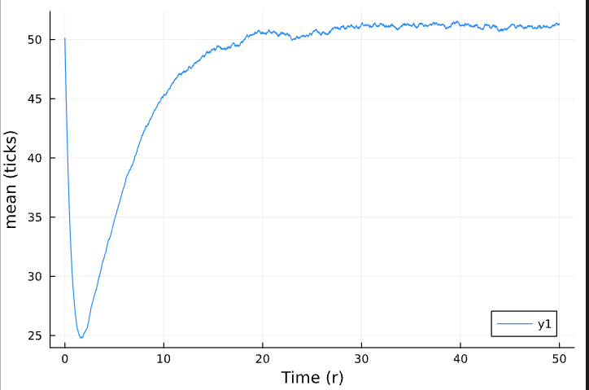
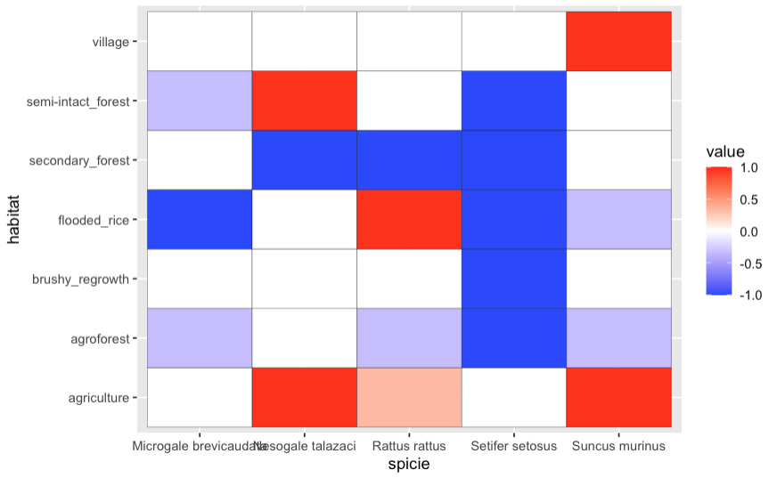

  

    <h3>Scatter Plots</h3>
    
    
  

  

    <h3>Bar Plot</h3>
    
  

  

    <h3>Pie Chart</h3>
    
  

  

    <h3>Heatmaps</h3>
    
    
  

  

    <h3>Violin Plot</h3>
    
  

  

    <h3>3D Animation</h3>
    
  

